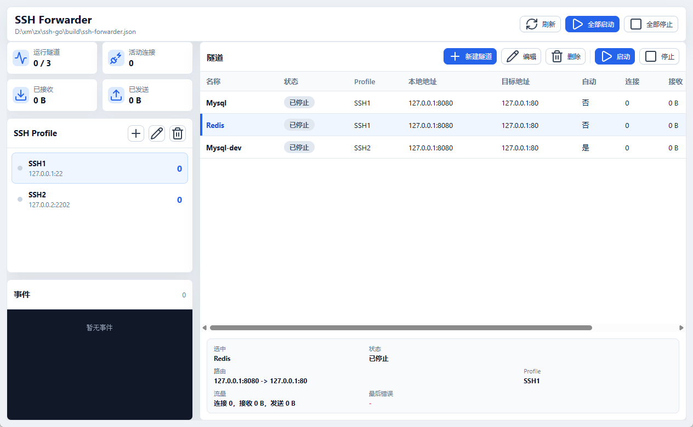

# SSH Forwarder

SSH Forwarder 是一个基于 Go、Wails 和 Vite 的桌面工具，用来管理本地端口到远端服务的 SSH TCP 隧道转发。

它适合把本机端口临时映射到只能通过跳板机访问的数据库、缓存、内网 HTTP 服务等目标地址。

## 界面预览



## 功能特性

- 管理多个 SSH Profile 和多条 TCP 隧道。
- 同一个 SSH Profile 下的多条隧道复用同一条 SSH 连接。
- 支持单条隧道启动/停止，也支持全部启动/停止。
- 支持密码认证和私钥认证。
- 支持 `accept-new`、`known-hosts`、`insecure` 三种主机密钥策略。
- 实时显示隧道状态、连接数、收发流量和事件日志。


启动后，访问本机 `127.0.0.1:3306` 的流量会通过 SSH 转发到远端目标服务。

## 快速开始

运行已构建的程序：

```powershell
.\build\bin\ssh-forwarder.exe
```

指定配置文件路径：

```powershell
.\build\bin\ssh-forwarder.exe -config .\ssh-forwarder.json
```

如果配置文件不存在，程序会自动创建：

```json
{
  "profiles": [],
  "tunnels": []
}
```

相对路径会按配置文件所在目录解析，例如私钥路径、`known_hosts` 路径等。

## 配置文件

默认配置文件名为 `ssh-forwarder.json`。完整示例见 [ssh-forwarder.example.json](./ssh-forwarder.example.json)。

```json
{
  "profiles": [
    {
      "id": "prod-bastion",
      "name": "Production Bastion",
      "host": "ssh.example.com",
      "port": 22,
      "username": "root",
      "auth": {
        "type": "key",
        "keyPath": "keys/id_rsa"
      },
      "hostKeyPolicy": "accept-new",
      "connectTimeoutSeconds": 8,
      "keepAliveSeconds": 30
    }
  ],
  "tunnels": [
    {
      "id": "mysql",
      "name": "MySQL",
      "profileId": "prod-bastion",
      "localHost": "127.0.0.1",
      "localPort": 3306,
      "targetHost": "127.0.0.1",
      "targetPort": 3306,
      "autoStart": false
    }
  ]
}
```

### Profile 字段

| 字段 | 说明 |
| --- | --- |
| `id` | 必填，唯一标识，只允许字母、数字、下划线和短横线，最长 64 个字符。 |
| `name` | 显示名称，留空时使用 `id`。 |
| `host` | 必填，SSH 主机地址。 |
| `port` | SSH 端口，默认 `22`，范围 `1-65535`。 |
| `username` | 必填，SSH 用户名。 |
| `auth.type` | 必填，可选 `password` 或 `key`。 |
| `auth.password` | 密码认证时必填。 |
| `auth.keyPath` | 私钥认证时必填。 |
| `auth.passphrase` | 私钥口令，可选。 |
| `hostKeyPolicy` | 主机密钥策略，可选 `accept-new`、`known-hosts`、`insecure`。 |
| `knownHostsPath` | 自定义 `known_hosts` 路径，可选。 |
| `connectTimeoutSeconds` | SSH 连接超时秒数，默认 `8`。 |
| `keepAliveSeconds` | SSH keepalive 间隔秒数，默认 `30`。 |

### Tunnel 字段

| 字段 | 说明 |
| --- | --- |
| `id` | 必填，唯一标识，只允许字母、数字、下划线和短横线，最长 64 个字符。 |
| `name` | 显示名称，留空时使用 `id`。 |
| `profileId` | 必填，引用一个已有 Profile。 |
| `localHost` | 本地监听地址，留空时使用 `127.0.0.1`。 |
| `localPort` | 本地监听端口，范围 `1-65535`。 |
| `targetHost` | 必填，SSH 服务器可访问的目标地址。 |
| `targetPort` | 目标端口，范围 `1-65535`。 |
| `autoStart` | 程序启动时是否自动启动该隧道。 |

## 主机密钥策略

- `accept-new`：默认值。首次连接时自动写入 `known_hosts`，后续连接会校验主机密钥。
- `known-hosts`：只信任已有 `known_hosts` 中的主机密钥。
- `insecure`：不校验主机密钥，只建议临时测试使用。

生产环境建议使用 `accept-new` 或 `known-hosts`。

## 开发环境

需要安装：

- Go 1.23 或更高版本
- Node.js 和 npm，Node.js 需要满足 `^20.19.0 || >=22.12.0`
- Wails v2 CLI
- Windows WebView2 Runtime

安装 Wails CLI：

```powershell
go install github.com/wailsapp/wails/v2/cmd/wails@v2.10.2
```

检查环境：

```powershell
wails doctor
```

开发运行：

```powershell
npm install --prefix .\frontend
wails dev
```

生产构建：

```powershell
wails build
```

构建产物默认位于：

```text
build\bin\ssh-forwarder.exe
```


## 常见构建问题

### ERR_UNSUPPORTED_ESM_URL_SCHEME

如果构建时在 `Compiling frontend` 阶段出现类似错误：

```text
Error [ERR_UNSUPPORTED_ESM_URL_SCHEME]: Only file and data URLs are supported by the default ESM loader. Received protocol 'node:'
```

通常是当前终端使用的 Node.js 版本过旧，不能满足 Vite 对 ESM 和 `node:` 内置模块导入协议的要求。

先检查当前终端实际使用的版本和路径：

```powershell
node -v
npm -v
where node
where npm
```

如果使用 nvm-windows，可以切换到已安装的新版本：

```powershell
nvm list
nvm use <版本号>
```

切换后重新执行：

```powershell
wails build
```

## 项目结构

```text
.
├── app.go                  # Wails 前端绑定接口
├── main.go                 # 桌面应用入口
├── internal/config         # JSON 配置读写、重载和校验
├── internal/tunnel         # SSH 连接、连接复用和 TCP 隧道转发
├── frontend                # Vite 前端界面
├── ssh-forwarder.example.json
└── wails.json
```

## 许可证

本项目采用 [MIT License](./LICENSE)。
